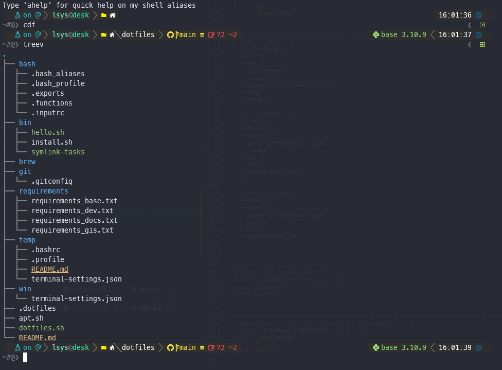

# .files for Windows + WSL

## My key concerns/needs

* Bash should be properly set up with prompts (via `Oh-My-Posh`)
* Install using package managers whenever possible (`apt`, `brew`, `winget`, `choco`, `npm`)
* (Mini)Conda, Jupyter, Python
* LaTeX + reveal-md for typesetting
* Main assests (dotfiles, bin/, etc.) are symlinked from this repo into `$HOME`

## Installation 

## Additional Details

### Bash

* `.exports`: for Environment variables (e.g., custom shell utilities and `conda` is specified here)

Will be installed in ???

`.bash_profile` is the first config that will be read by `bash`. So this file will source all other relevant dotfiles.

### References:

* [Mathias’s dotfiles](https://github.com/mathiasbynens/dotfiles)
  

  
(More notes)

  <ul>
    <li>Using his compartmentalization of `bash` dotfiles (bashrc, bash_profile, exports, functions, etc.) but using them in terms of a topical organization (so all of them are in `bash/`.</li>
    <li>`.functions`
    <li>Using his way of putting shell scripts in `bin/`
  </ul>
  

  
* [`webpro`'s Getting started with dotfiles](https://www.webpro.nl/articles/getting-started-with-dotfiles)
  

  
(More notes)

  <ul>
    <li>Using his way of using a `.functions` for shell scripts too complex for an alias (for `.bash_aliases`) but too small for stand-alone scripts (like in `bin/`). (This is of course a judgement call.)
    </li>
    <li>He is more explicit on the compartmentalizing of dotfiles
    </li>
  </ul>
  

* Topical organization  
    

    
(More notes)

    <ul>
      <li>
      <a href="https://driesvints.com/blog/getting-started-with-dotfiles/">Dries Vints's Getting Started with Dotfiles</a>
      </li>
      <li>
      <a href="https://zachholman.com/2010/08/dotfiles-are-meant-to-be-forked/">Zach Holman's Dotfiles Are Meant to Be Forked</a>
      </li>
    </ul>
    

  
* [Wynn Netherland's Dotfiles discovery](https://wynnnetherland.com/journal/dotfiles-discovery)  
    

    
(More notes)

    <ul>
      <li>
      Just do a search for known config file names on GitHub
      </li>
    </ul>
    

    
(`webpro`'s (Lars Kappert) [curated resources](https://github.com/webpro/awesome-dotfiles) is a good one to find other resources.)    
