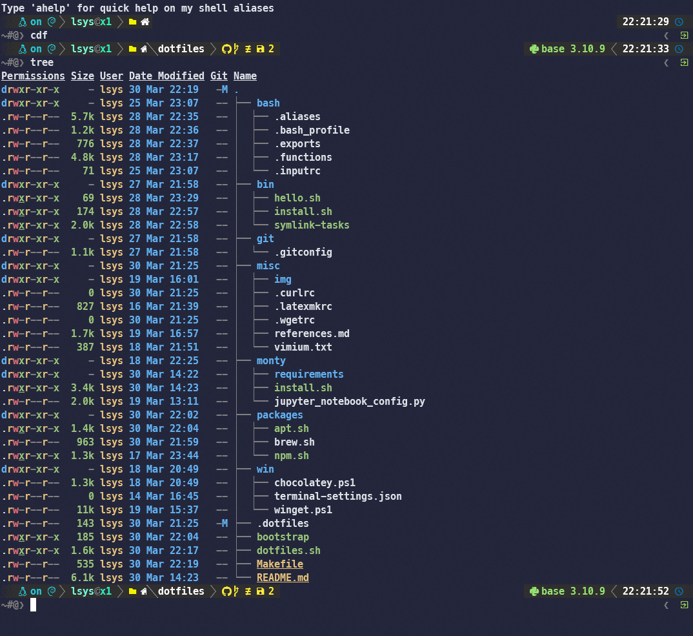

# .files for Windows + WSL


<!---------------------- TABLE OF CONTENT ---------------------->
# [Roadmap](#roadmap)
<details open><summary><b>show/hide</b></summary><p>

> - [My key concerns/needs](#my-key-concernsneeds)
> - [Installation](#installation)
> - [Additonal Details](#additional-details)
> - [References](#references)
</p></details><p></p>

## My key concerns/needs

* Install using package managers whenever possible (`apt`, `brew`, `winget`, `choco`, `npm`)
* Main assests (dotfiles, bin/, etc.) are symlinked from this repo into `$HOME`
* (Mini)Conda, Jupyter, Python
* LaTeX + reveal-md for typesetting
* Bash should be properly set up with prompts (via `Oh-My-Posh`)

## Installation

### Using the bootstrap script
The **`bootstrap.sh`** file will take care of installing almost everything in my Linux subsystem. Just `cd` into the local folder of this repo and run `./bootstrap.sh`. This `bootstrap.sh` script calls the individual installers to set up the dotfiles, `bin/`, and package installers using `APT`, `Homebrew` (`Linuxbrew`), and `NPM`.

```shell
cd $HOME 
git clone https://github.com/LSYS/dotfiles.git
cd dotfiles
./bootstrap.sh
```

### Using the PowerShell scripts
The `PowerShell` scripts in `win/` will take care of installing Windows OS applications using `winget` and, to a smaller extent for applications that cannot be installed from `winget`, `Chocolatey`. The `winget.ps1` installs the desktop application and basic utilities. The `choco.ps1` installs mainly `LaTeX` and `PostgreSQL` (requires Admin).

To install apps using `winget` and `Chocolatey`:
```PowerShell
cd win
./winget.ps1
./choco
```

### Order of installation (Win)

1. Install `WSL`: Open `PowerShell` as administrator 
    ```PowerShell
    wsl --install -d Debian
    # confirm that bash is running
    which $SHELL
    ```
  
1. Install Native Windows apps: Open `PowerShell`
    ```PowerShell
    ./winget.ps1
    ./choco.ps1
    ```
    This will install `WindowsTerminal` and `Oh-My-Posh`. Type
    ```PowerShell
    oh-my-posh font install
    ```
    to install the fonts and choose Meslo (recommended). Seth the font in WindowTerminal setting (settings.json)
    ```json
    {
        "profiles":
        {
            "defaults":
            {
                "font":
                {
                    "face": "MesloLGM NF"
                }
            }
        }
    }
    ```
3. Open WSL (`Debian`) in WindowsTerminal and run the `bootstrap.sh` installer:
    ```bash
    cd $HOME/dotfiles && ./bootstrap.sh
    ```
    This will call the following installers:
    * `dotfiles.sh`
    * `bin/install.sh`
    * `apt/install.sh`
    * `brew/install.sh`
    * `npm/install.sh`
    * `monty/install.sh`

4. Once `Oh-My-Posh` is installed via `brew/install.sh`. Check that it works
    ```bash
    eval "$(oh-my-posh init bash)"
    ```
    and symlink the poshthemes to home (where `bash/.bash_profile` will look for the themes)
    ```bash
    cd $HOME && mkdir poshthemes && cd poshthemes
    ln -s /home/linuxbrew/.linuxbrew/opt/oh-my-posh/themes/* 
    ```

## Additional Details

### Bash

Will be installed in `./dotfiles.sh`.
```console
.
├── bash
│  ├── .bash_aliases
│  ├── .bash_profile
│  ├── .exports
│  ├── .functions
│  └── .inputrc
```

* `.bash_aliases`: Shell aliases defined here (including some for `Git`)
* `.bash_profile`: General bash settings (including `Oh-My-Posh` and sources other bash `dotfiles`)
* `.exports`: For `environment variables` (e.g., custom shell utilities and `conda` is specified here)
* `.functions`: For functions too big for `bash_aliases` but too small for `bin/`
* `.inputrc`: Config for input (`case-insensitive completion` here) 

(**Note:** `.bash_profile` is the first config that will be read by `bash`. So this file will source all other relevant dotfiles.)

### Git

Will be installed in `./dotfiles.sh`.

```Console
├── git
│  └── .gitconfig
```

`.gitconfig` includes `Git` aliases.

### Python + (Mini)Conda (`.monty/`)

Will be installed by `./monty.install.sh`.
```console
├── monty
│  ├── install.sh
│  ├── jupyter_notebook_config.py
│  └── requirements
│     ├── requirements_base.txt
│     ├── requirements_dev.txt
│     ├── requirements_docs.txt
│     └── requirements_gis.txt
```

* `requirements/` contain the individual requirement*.txt files
* `jupyter_notebook_config.py` sets up Jupyter Notebooks to run from Chrome (native from Windows)
* `install.sh` installs Miniconda, Jupyter Notebook (and its extensions), installs base packages into base, creates `venv`s and install the relevant packages into it.

### NPM

Will be installed by `npm/install.sh`.
```console
├── npm
│  └── install.sh
```

* Sets up `NVM` and `NPM`. 
* Installs `reveal-md` (`reveal.js`) and other utilities only available from `NPM`.

### Windows

Will be installed by `win/winget.ps1` and `win/choco.ps1` (using PowerShell; `win/choco.ps1` will require admin priviledges).

```console
├── win
│  ├── chocolatey.ps1
│  ├── terminal-settings.json
│  └── winget.ps1
```

* `winget.ps1` will install `winget` and follow up by installing other applications (e.g. Chrome, WindowsTerminal, Oh-My-Posh, GNUMake, PowerToys, 7zip, Slack, Sublime Text, Git etc.).
* `chocolatey.ps1` will install `Chocolatey` and other Windows app that cannot be installed by `winget` (e.g., MikTex, TexStudio, tree, postgresql, pgadmin4, du, etc.). This will require `PowerShell` admin priviledges. 


## References

[See here.](https://github.com/LSYS/dotfiles/blob/main/misc/references.md)
